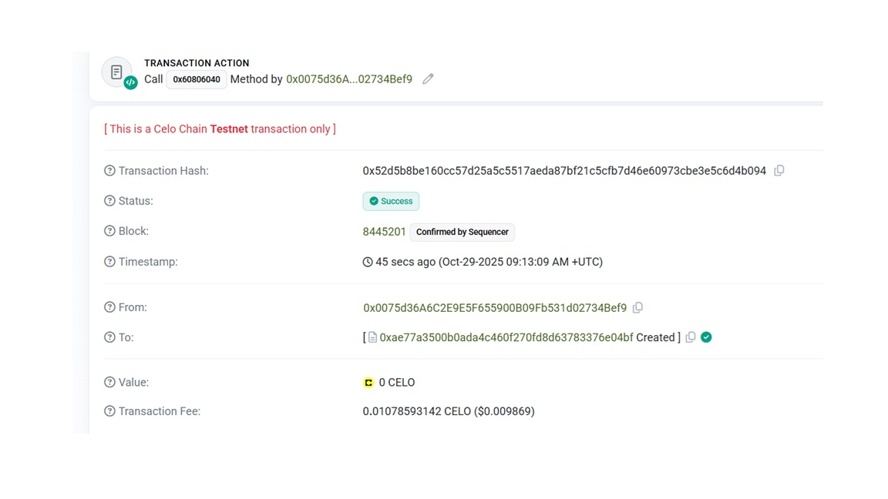

🎰 FlipCoin DApp on Celo

A simple decentralized coin flip betting game built with Solidity and deployed on the Celo Blockchain (Sepolia Testnet).

This project demonstrates how smart contracts can enable transparent, verifiable, and autonomous gaming logic — with no intermediaries required.

## 📸 Deployment Transaction

📜 Project Description

FlipCoin DApp allows users to bet ETH (or CELO on testnet) on a coin flip — choosing Heads (true) or Tails (false).

If the player wins, they receive double their bet.

All bets and results are stored on-chain.

The game logic is fully transparent and open for everyone to inspect.

⚠️ Note: Randomness in this demo uses simple block data and is not secure for production use. It’s intended purely for educational purposes.

⚙️ What It Does

The owner deploys the smart contract.

Users send a small amount of ETH/CELO along with their bet (Heads/Tails).

The contract determines the result using pseudo-random block data.

Winners automatically receive 2× their bet.

The owner can withdraw accumulated funds anytime.

🌟 Features

🎯 Simple & Educational: Easy-to-understand Solidity code for beginners.
💰 Automated Payouts: Winners are paid instantly by the smart contract.
📊 Transparent Results: Every bet and outcome is publicly verifiable on-chain.
⚡ Celo Sepolia Deployment: Built and tested on the Celo Sepolia Testnet.
👑 Owner Controls: Only the owner can withdraw or manage contract funds.

📄 Smart Contract

Language: Solidity ^0.8.20

Framework: Remix / Hardhat compatible

Network: Celo Sepolia Testnet

Contract Name: FlipCoin

Deployed Transaction or Contract Address:
👉 View on Blockscout
 (replace with your actual contract address once deployed)

🧩 Future Enhancements

🎮 Build a React or Next.js front-end using Celo Composer or Ethers.js.
🪙 Use Chainlink VRF or another secure randomness source.
💼 Add player history and leaderboard functionality.
📊 Display live game results & statistics in the UI.
🔐 Add betting limits and configurable house fees.

🙌 Acknowledgments

Celo Blockchain — for sustainable, developer-friendly infrastructure

Remix IDE — for fast smart contract prototyping

Blockscout — for transparent on-chain transaction viewing

💡 Pro Tip

Start small — deploy, test, tweak logic, and learn by doing.
Observe outcomes and discover how decentralized games work under the hood.

🧠 Made with ❤️ by Sumedha Chowdhury
